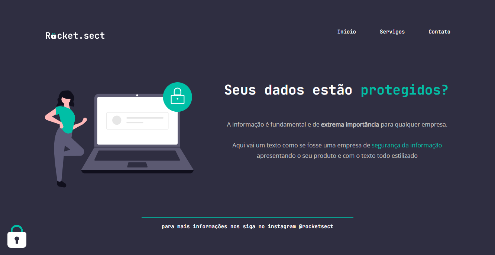

<h1 align="center">
  
</h1>

<h2 align="center" >Descrição do Projeto</h2>

  Rocket Sect é o ultimo desafio do Nivel 02 do programa Explorer da Rockeseat.

 

   

     Desafio tem como principal objetivo realizar a construção de um layout totalmente do zero,
     apenas baseando no protótipo passado pelo Figma, 
     utilizando os conhecimentos adquiridos com as tecnologias de HTML e CSS com conceitos do flebox.
  

   
  
  
  
## :rocket: Tecnologias

Esse projeto foi desenvolvido com as seguintes tecnologias:

✔️ HTML

✔️ CSS

✔️ Flex-box
